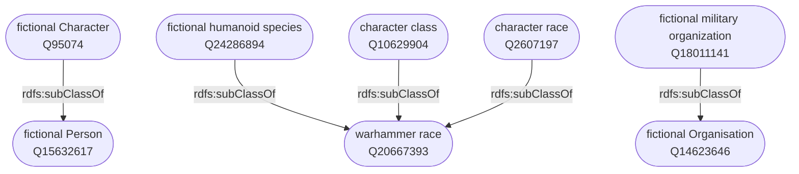
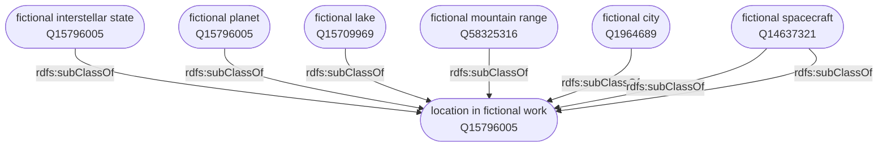

```mermaid
graph
A([fictional Character<br>Q95074]) -- rdfs:subClassOf -->2A([fictional Person<br>Q15632617])

B([fictional humanoid species<br>Q24286894]) -- rdfs:subClassOf -->2b([warhammer race<br>Q20667393])
C([character class<br>Q10629904]) -- rdfs:subClassOf -->2b
D([character race<br>Q2607197]) -- rdfs:subClassOf -->2b

E([fictional military organization<br>Q18011141]) -- rdfs:subClassOf -->2c([fictional Organisation<br>Q14623646])
```

```mermaid
graph
E([fictional interstellar state<br>Q15796005]) -- rdfs:subClassOf -->2d([location in fictional work<br>Q15796005])
F([fictional planet<br>Q15796005]) -- rdfs:subClassOf -->2d
G([fictional lake<br>Q15709969]) -- rdfs:subClassOf -->2d
H([fictional mountain range<br>Q58325316 ]) -- rdfs:subClassOf -->2d
I([fictional city<br>Q1964689]) -- rdfs:subClassOf -->2d
J([fictional country<br>Q1145276]) -- rdfs:subClassOf -->2d
J([fictional spacecraft<br>Q14637321]) -- rdfs:subClassOf -->2d

```
