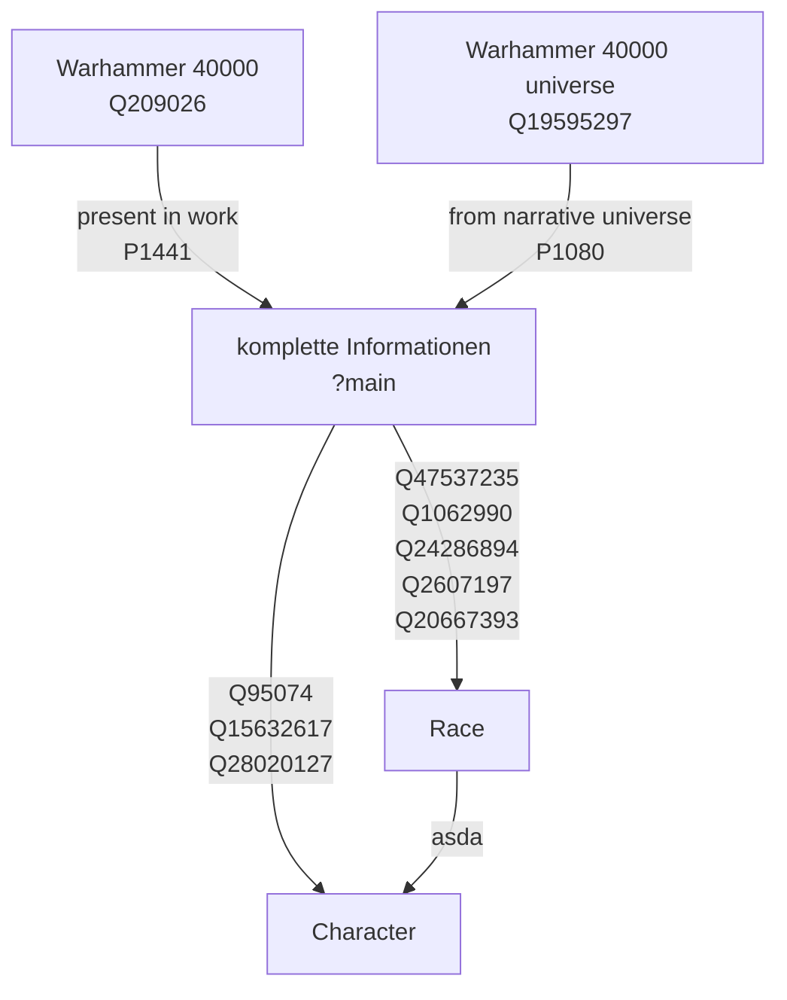

```mermaid
graph
A[Warhammer 40000<br>Q209026] -- present in work<br>P1441 -->C[komplette Informationen<br>?main]
B[Warhammer 40000 universe<br>Q19595297] -- from narrative universe<br>P1080 -->C

C -- Q47537235<br>Q1062990<br>Q24286894<br>Q2607197<br>Q20667393 --> D[Race]

C -- Q95074<br>Q15632617<br>Q28020127 --> E[Character]
D -- asda --> E[Character]
```

